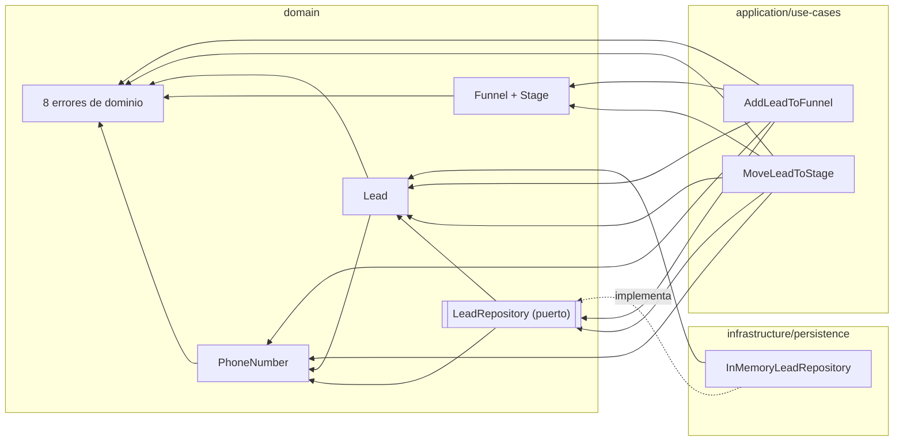

# Mapa mental — Lead Funnel Service

Registro de decisiones tomadas antes de escribir código. Cada decisión lleva su fundamento,
porque en la sesión de review se pregunta el porqué, no el qué.

---

## Mapa de dependencias



`index.ts` queda fuera del diagrama: es el composition root — construye el `Funnel`, el repositorio
concreto y los casos de uso, y es el **único** sitio que conoce las tres capas a la vez.

Lo que el diagrama afirma:

- **Todas las flechas apuntan hacia dentro.** Infraestructura conoce el dominio; el dominio no sabe
  que existe infraestructura. La única flecha que sale de `INFRA` es la que implementa el puerto, y el
  puerto vive en el dominio — esa es la inversión de dependencias que sostiene la arquitectura.
- **`PhoneNumber` es dominio, no utilidad.** Está dentro porque es la regla de identidad (§1). Si
  viviera en infraestructura, el repositorio sería el dueño de decidir qué leads son el mismo.
- **Los 8 errores son dominio.** Los casos de uso los lanzan pero no los definen: son el vocabulario
  con el que el dominio dice que no. De ahí `ADD --> ERRORS` y `MOVE --> ERRORS`.
- **Los casos de uso conocen `PhoneNumber`.** El DTO entra como `string` y el parseo ocurre al entrar
  al caso de uso (§1), así que es él quien construye el VO — no el repositorio, que ya lo recibe
  canónico.
- **No hay flecha entre `Lead` y `Funnel`.** El `Lead` guarda un `stageId`, no una referencia al
  `Stage`. Quien los cruza es el caso de uso — misma razón por la que la capacidad no puede ser
  invariante de entidad (§2).

Los flujos de ejecución no se dibujan: los pipelines de §4 llevan el error de cada paso y dicen más
que un flowchart.

---

## 0. Marco fijo (heredado del esqueleto, no se discute)

Restricciones que el código entregado ya impone y que por tanto no son decisión abierta:

| Restricción | Origen |
|---|---|
| Una instancia de caso de uso = un funnel, inyectado en el constructor | `AddLeadToFunnel.ts:18-21`, `MoveLeadToStage.ts:19-22` |
| `execute(): Promise<void>` — el error **es** el contrato de salida | ambos casos de uso |
| `AddLeadToFunnelData {phone, name}` / `MoveLeadToStageData {phone, targetStageId}` | DTOs de borde, entran como `string` |
| Alta siempre a `stages[0]`; no existe "añadir a etapa arbitraria" | README Part 1.1 |
| `save` es el único camino de escritura ⇒ upsert por identidad | `LeadRepository.ts:9-11` |
| La ocupación se **calcula** (`findByStage().length`), no se almacena | ausencia de `count` en el puerto |
| Orden de etapas = posición en el array; sin campo `order` | `Funnel.ts:19` |
| `Stage` es interfaz estructural, construida con literales de objeto | `Funnel.ts:10-14` + `index.ts:16-21` |
| `capacity?: number` ⇒ `undefined` ya es la representación canónica de "sin tope" | `Funnel.ts:13` |
| Discriminación de errores por `instanceof` / `name`; sin base común ni códigos | `domain/errors/` |
| Tests en `tests/` en la raíz, no colocados junto al código | `jest.config.js` → `roots` |
| Sin dependencias HTTP ⇒ el bonus es una función pura JSON→JSON | `package.json` |
| `strict: true`, target ES2020 | `tsconfig.json` |

---

## 1. Modelo de dominio

### `PhoneNumber` — value object

- **Acepta:** `+` seguido de 8–15 dígitos, ignorando separadores: espacios, guiones, paréntesis y puntos.
- **Rechaza:** todo lo demás — sin código de país, con extensiones, con letras. → `InvalidPhoneNumberError`
- **Forma canónica:** `+` + dígitos, sin separadores.
- **Igualdad:** igualdad del string canónico.
- **Dónde vive:** dominio. El repositorio recibe un VO ya canónico y solo indexa su string,
  así que **la regla de identidad no se filtra a infraestructura**.
- **Frontera:** el DTO sigue siendo `phone: string`. El parseo ocurre al entrar al caso de uso.

**Fundamento del cambio (era "identidad por secuencia de dígitos"):** WhatsApp devuelve los móviles
mexicanos como `5215512345678` y el agente teclea `55 1234 5678`. Como secuencias de dígitos son
identidades distintas para la misma línea física. Quedarse con los dígitos unifica ruido tipográfico
y no unifica **ninguna** diferencia de representación real — que es donde viven los duplicados.
Además era incoherente con la decisión de validar y rechazar en el constructor de `Funnel`:
dos filosofías opuestas para el mismo problema (input no confiable en el borde) en el mismo commit.

**Por qué se ignoran los separadores:** los separadores son **presentación, no dato**. Lo que decide
la identidad es el `+` y los dígitos; que quien escribe use espacios, guiones, paréntesis o puntos no
cambia a qué línea telefónica se refiere. Tratar el espacio distinto del guion sería un corte
arbitrario en la misma categoría de ruido.

**La línea exacta del supuesto 4:** *normalizamos presentación, nunca inferimos semántica.* Por eso
esto no reabre el caso `521`: ahí la diferencia está en **los dígitos**, no en la presentación, y
decidir que `+5215512345678` y `+525512345678` son la misma línea exigiría saber que el `1` es un
prefijo de móvil mexicano — inferencia semántica, y encima dependiente de región.

**Límite documentado:** normalizar un número local exige una región por defecto, que es configuración
de workspace, y ni `AddLeadToFunnelData` ni `Funnel` la transportan. La ambigüedad se devuelve a
quien llama. Esto va a `ANALYSIS.md` §0.

### `Lead`

- `phone: PhoneNumber` — hoy `string` en `Lead.ts:10`, cambia.
- `name: string`, `readonly`. Vacío o solo espacios → `InvalidLeadError`.
- `private _stageId: string` + getter público.
- `isAt(stageId): boolean` — consulta pura, sin regla dentro. Ver §2.
- `moveTo(targetStageId)` — **única vía de mutación**; garantiza `destino ≠ actual`
  y lanza `InvalidStageTransitionError` si no.
- Sin id subrogado, sin `createdAt`/`updatedAt`, sin historial.

**Fundamento de la encapsulación:** `stageId` público en el esqueleto **sugiere** mutación in-place,
no la decide. Ningún call site actual escribe ese campo desde fuera, así que pasar a `private` no
rompe nada. Es el punto natural para el invariante.

### `Funnel` / `Stage`

- **Valida al construirse** → `InvalidFunnelError`: ≥1 etapa; ids no vacíos y únicos;
  `capacity` entera ≥ 0 si está presente.
- **Semántica de `capacity`:**
  - `undefined` = sin tope
  - `0` = **etapa cerrada** (no ilimitada)
  - negativa o no entera = funnel inválido
- Comportamiento que necesitan los casos de uso: primera etapa, buscar etapa por id,
  exponer el tope de una etapa.

**Trampa a evitar:** el tipo es `number | undefined` y `strict` **no** protege contra
`if (stage.capacity && …)`, que trataría `0` como ilimitado. Es exactamente el bug que esta
decisión previene, y por eso tiene test propio.

---

## 2. Reparto de invariantes por capa

| Invariante | Quién la garantiza | Por qué ahí |
|---|---|---|
| Teléfono bien formado | `PhoneNumber` | dato autónomo, verificable solo con la entrada |
| Nombre no vacío | `Lead` | dato autónomo del propio lead |
| Funnel bien formado | constructor de `Funnel` | invariante de construcción |
| La etapa destino existe | `Funnel` | único que conoce su configuración |
| Destino ≠ actual | `Lead.moveTo()` | depende solo del estado del propio lead |
| **Capacidad disponible** | **caso de uso** | cruza **tope (`Funnel`) × ocupación (repositorio)** |
| Unicidad de teléfono | caso de uso | requiere consultar el repositorio |

**La capacidad es la única de las cuatro business rules estructuralmente imposible de sostener como
invariante de dominio** con los puertos dados: el `Funnel` conoce el tope, el repositorio conoce la
ocupación, y solo el caso de uso ve ambos. Eso explica por qué la entidad no puede validarla por su
cuenta y por qué el puerto necesita `findByStage`. Se reparte en dos capas por necesidad, no por
pereza — y se escribe en `ANALYSIS.md`, porque si no se lee como inconsistencia.

### Separar la pregunta del orden: `Lead.isAt()`

`moveTo()` sostiene el invariante `destino ≠ actual` y además muta. Pero la precedencia (§4) exige
comprobar `destino ≠ actual` **antes** que la capacidad, y la capacidad debe comprobarse **antes** de
mutar (§5). Se resuelve **separando la pregunta del orden**:

- `Lead.isAt(stageId): boolean` — consulta pura, sin regla dentro.
- El **caso de uso** la usa para fijar la precedencia del error: decide **qué error ve quien llama**.
- `moveTo()` conserva su guarda: garantiza que la entidad **nunca entra en estado inválido**,
  la llame quien la llame.

Un solo predicado, dos call sites con propósitos distintos. No hay lógica duplicada: hay una consulta
reutilizada por una capa que ordena errores y por otra que protege un invariante.

**La guarda de `moveTo()` es inalcanzable a través del caso de uso, por diseño** — ese es justamente el
motivo de que `isAt` exista. Por eso los dos mensajes de `InvalidStageTransitionError` conviven sin
abstraerse: no son una regla duplicada sino dos audiencias — el del caso de uso lo lee quien llama a la
API, el de `moveTo` lo lee quien invoca la entidad directamente, y por eso ese nombra origen y destino.

**Descartado `canMoveTo()`:** implicaría que la entidad conoce todas las reglas del movimiento, y la
capacidad no es asunto suyo — cruza tope y ocupación, que el `Lead` no ve. Un predicado con ese nombre
mentiría sobre su alcance.

---

## 3. Reglas decididas

1. **Transiciones abiertas.** Cualquier etapa existente distinta de la actual — adelante, atrás o
   salto. Incluye salir de `Closed`.
   - *Fundamento primario (textual):* la regla 4 nombra un único caso inválido y la regla 2 solo
     exige que el destino exista. No hay nada que prohibir.
   - *Fundamento secundario (diseño):* el núcleo permisivo es el sustrato sobre el que Q4 configura
     restricciones por workspace. **Q4 justifica una elección entre opciones ya permitidas; no deriva
     la regla.**
   - *Sobre la firma de `InvalidStageTransitionError(message)`:* una transición es una **relación
     binaria** — origen y destino. `InvalidStageTransitionError(stageId)` no podría decir de dónde
     venía el lead. El mensaje libre es la forma mínima para un error sobre un par. Ver el criterio
     de firmas al final de esta sección.
2. **Capacidad:** ausente = sin tope · `0` = etapa cerrada · negativa/no entera = funnel inválido.
3. **Lead inexistente al mover:** error de dominio propio (`LeadNotFoundError`), no reciclar uno existente.
4. **Identidad del teléfono:** value object `PhoneNumber`, E.164 estricto en el borde.
5. **Funnel validado al construirse.**
6. **Una instancia = un funnel** ⇒ el repositorio no lleva `funnelId`. La unicidad de teléfono es
   global al repositorio; el README dice "in a funnel" y el modelo de datos no conoce funnels.
   Se documenta como asunción.
7. **`save` es upsert por identidad; sin historial ni timestamps.**

**Principio transversal:** toda negativa del dominio lleva tipo propio. Ningún error se recicla para
significar dos cosas.

### Criterio de firmas de error

**El constructor lleva lo mínimo para reconstruir el hecho.** Uno solo, aplicado a tres formas:

| Forma del hecho | Qué basta | Firma | Errores |
|---|---|---|---|
| Sobre **una entidad** | su id | `(id)` | `DuplicateLeadError`, `StageNotFoundError`, `StageCapacityExceededError`, `LeadNotFoundError` |
| Sobre **un valor** | el valor rechazado | `(input)` | `InvalidPhoneNumberError` |
| Sobre **una relación** | el par | `(message)` | `InvalidStageTransitionError` |
| Sobre **una validación compuesta** | cuál de las causas falló | `(message)` | `InvalidLeadError`, `InvalidFunnelError` |

**El mensaje libre no es apertura a motivos nuevos: es que el hecho no cabe en un id.** Un par tiene
dos extremos; una validación compuesta tiene causas independientes que su id no permite reconstruir
—con el id de un funnel en la mano no se sabe si falló por no tener etapas, por ids duplicados o por
una capacity inválida—. En ambos casos el `message` es la forma **mínima**, no la forma **abierta**.

`InvalidPhoneNumberError` recibe el valor y no un mensaje porque el formato es **atómico**: con el
string rechazado delante y la regla enunciada en el mensaje, se reconstruye qué falló por inspección.
No hay causas independientes que distinguir.

---

## 4. Precedencia de validaciones

**Principio:** *de lo que depende solo de la petición a lo que depende del estado del mundo.
Primero los errores estables ante un reintento.*

### `AddLeadToFunnel`

```
entrada válida (PhoneNumber, name)  → InvalidPhoneNumberError / InvalidLeadError
  → duplicado                       → DuplicateLeadError
  → cupo en stages[0]               → StageCapacityExceededError
  → save
```

### `MoveLeadToStage`

```
entrada válida (PhoneNumber)        → InvalidPhoneNumberError
  → etapa destino existe            → StageNotFoundError
  → lead existe                     → LeadNotFoundError
  → destino ≠ actual                → InvalidStageTransitionError
  → cupo en destino                 → StageCapacityExceededError
  → moveTo + save
```

**Por qué `StageNotFoundError` va antes que `LeadNotFoundError`:** el funnel se fija en el constructor
y es inmutable en runtime, así que la validez de `targetStageId` es función pura de petición + config;
la existencia del lead depende del repositorio. Además evita una consulta al repo en el caso de fallo,
y en el bonus HTTP el orden natural es 400 antes que 404. El docstring de `MoveLeadToStage.ts:12-16`
enumera el lead primero, pero **enumeración no es precedencia** — el mismo argumento que aplica a las
reglas 1–4 del README, que son un conjunto y no una secuencia.

### Casos que el principio resuelve

- **misma etapa + llena** → `InvalidStageTransitionError`. La petición es incoherente en sí misma;
  la ocupación ni se consulta.
- **duplicado + primera etapa llena** → `DuplicateLeadError`. El duplicado es permanente;
  el cupo es transitorio. Y como el duplicado se resuelve antes en el pipeline, **la ocupación ni se
  consulta** — misma garantía que en el caso de la misma etapa, y por el mismo motivo.

---

## 5. Aliasing y orden de mutación

`InMemoryLeadRepository` guarda **referencias vivas**: mutar el `Lead` devuelto por `findByPhone`
cambia el estado "persistido" **sin llamar a `save`**.

- **Mitigación:** mutar solo después de que pasen todas las validaciones.
  `moveTo()` reduce la superficie a un único punto.
- **Honestidad:** no es garantía estructural, es **disciplina de orden**. `moveTo()` puede seguir
  invocándose antes de comprobar el cupo.
- **Blindaje:** test *"movimiento rechazado ⇒ el lead sigue en su etapa original"*.
- Esta es la evidencia concreta a citar en Part 2 Q1.

---

## 6. Errores del dominio

**Del esqueleto (4):**

| Error | Firma | Cuándo |
|---|---|---|
| `DuplicateLeadError` | `(phone)` | alta con teléfono ya presente |
| `StageNotFoundError` | `(stageId)` | destino inexistente en el funnel |
| `StageCapacityExceededError` | `(stageId)` | destino sin cupo |
| `InvalidStageTransitionError` | `(message)` | destino === actual |

**Nuevos (4):**

| Error | Cuándo |
|---|---|
| `InvalidPhoneNumberError` | el string no cumple `+` + 8–15 dígitos |
| `InvalidLeadError` | `name` vacío o solo espacios |
| `InvalidFunnelError` | funnel sin etapas, ids duplicados/vacíos, capacity inválida |
| `LeadNotFoundError` | mover un teléfono que no existe en el repositorio |

Todos siguen la convención del esqueleto: extienden `Error`, fijan `this.name`, sin base común.
Las firmas salen del criterio único del §3, no de la cantidad de motivos posibles.

`LeadNotFoundError` recibe `string` y no `PhoneNumber` a propósito: mantiene los errores como **hojas
sin dependencias** dentro del dominio, que es por lo que se implementan antes que el value object.
El caso de uso pasa `phone.value`.

`DuplicateLeadError` recibe el **teléfono canónico**, simétrico con `LeadNotFoundError`: los dos hablan
de la misma entidad por su identidad, y la identidad es la forma canónica. Reportar el string crudo de
la petición nombraría una presentación, no un lead.

---

## 7. Puerto y adaptador

- `LeadRepository`: `save` / `findByPhone(PhoneNumber)` / `findByStage(stageId)`.
- `findByPhone` cambia de `string` a `PhoneNumber`. El README autoriza extender el puerto
  (`LeadRepository.ts:6`).
- `findByPhone` devuelve `Lead | null` — null, no undefined; `strict` obliga a estrechar.
- `InMemoryLeadRepository`: `Map` indexado por el string canónico del `PhoneNumber`.

---

## 8. Simulación (`index.ts`)

Los cuatro escenarios que exige el README, **más uno**: el funnel de demo solo pone `capacity: 2` en
`qualified` y deja `new` sin tope, así que **nunca ejercita capacidad en el alta**. Hay que dar tope a
la primera etapa para que la regla 3 se vea en las dos direcciones que el README menciona
(*"Moving **or adding** a lead into a full stage"*).

1. alta correcta
2. movimiento válido
3. duplicado rechazado
4. movimiento inválido rechazado
5. **alta rechazada por cupo en la primera etapa**

Los rechazos se demuestran capturando excepciones; `main().catch(console.error)` ya está.

---

## 9. Tests (`tests/`)

Cobertura mínima por regla de negocio, más los tres que salen de este análisis:

- **aliasing:** movimiento rechazado ⇒ el lead sigue en su etapa original
- **truthiness:** `capacity: 0` ⇒ etapa cerrada, no ilimitada
- **precedencia:** misma-etapa-llena → transición · duplicado-con-primera-etapa-llena → duplicado
- **identidad:** `+52 55 1234 5678` y `+525512345678` son el mismo lead; `5512345678` se rechaza

---

## 10. Qué va a `ANALYSIS.md`

**§0 Assumptions** — los 7 supuestos · el principio de precedencia · el reparto de invariantes en dos
capas · la asunción de unicidad global frente al "in a funnel" del README · el límite de la
normalización sin región · tiempo real invertido.

**Q1 Concurrency** — check-then-act entre `findByStage().length` y `save`; `execute()` sin
`expectedVersion` ni operación atómica en el puerto; el aliasing como disciplina y no garantía.
En BD real: índice único sobre el teléfono canónico, y la capacidad como operación condicional o
reserva, no como lectura previa.

**Q2 Integration** — evento con `from` y `to`. **Este servicio no editorializa:** salir de `Closed` y
avanzar de `New` no son el mismo hecho de negocio, pero la respuesta no es prohibirlo — es que el
consumidor decida si fue reapertura o corrección.

**Q3 Scale** — *colisión conocida:* el supuesto 7 (sin timestamps) hace que *"most recent first"* no
sea contestable con el modelo actual. Es un límite deliberado y se dice como tal. Además `findByStage`
no tiene orden ni paginación, y la ocupación se recalcula en cada comprobación de cupo.

**Q4 Evolution** — el núcleo permisivo absorbe restricciones por workspace sin reescritura.
Qué me niego a construir y por qué.
